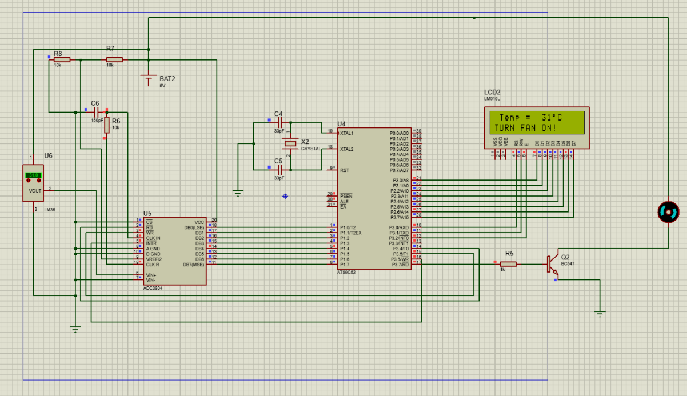
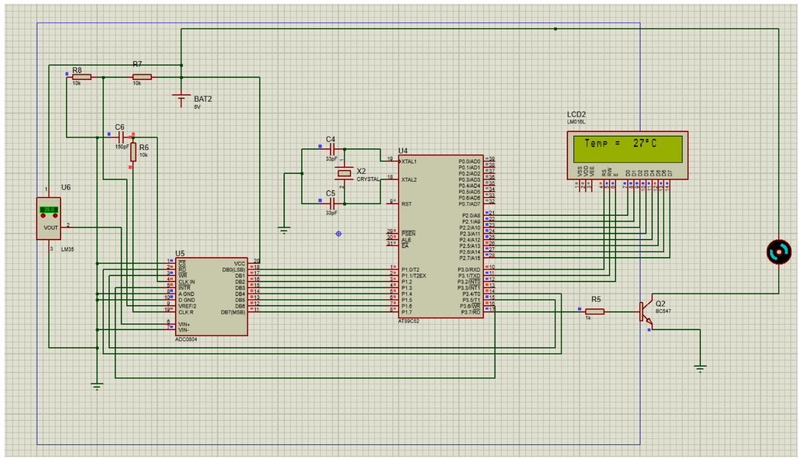

# Temperature Controlled Fan Speed System using AT89S52

This embedded system automatically controls a DC fan based on ambient temperature using the **AT89S52 microcontroller**, **ADC0804**, and **LM35 temperature sensor**.  
When the temperature exceeds 29°C, the fan turns ON automatically; otherwise, it remains OFF.

---

## 🧩 Components Used
- AT89S52 microcontroller  
- ADC0804 (Analog to Digital Converter)  
- LM35 temperature sensor  
- 16x2 LCD display  
- BC547 transistor (fan driver)  
- DC fan, resistors, capacitors, and 10k potentiometer  

---

## 🧰 Tools Used
- **Keil µVision IDE** – for Embedded C code  
- **Proteus Design Suite** – for circuit simulation and testing  

---

## ⚙️ Circuit Diagrams
**When Temperature > Threshold (Fan ON):**

**When Temperature < Threshold (Fan OFF):**

---

## 💡 Working Principle
1. LM35 senses ambient temperature and outputs an analog voltage.  
2. ADC0804 converts the analog voltage into a digital signal.  
3. AT89S52 processes the data and determines whether to activate the fan.  
4. Temperature and fan status are displayed on the LCD.  

---

## 📜 License
This project is licensed under the **MIT License**. See the `LICENSE` file for more details.

---

## 👨‍💻 Author
**Sreyas Kishore **  

